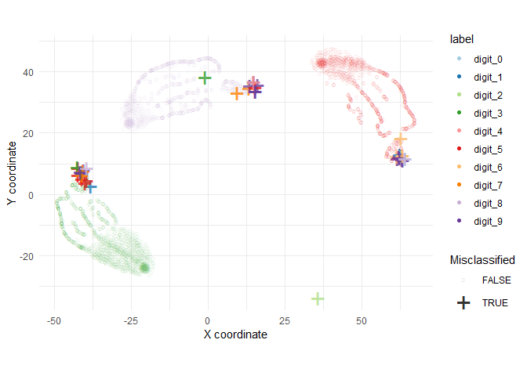

# Untitled


Loading packages

``` r
library(tidyverse)
```

    ── Attaching core tidyverse packages ──────────────────────── tidyverse 2.0.0 ──
    ✔ dplyr     1.1.4     ✔ readr     2.1.5
    ✔ forcats   1.0.1     ✔ stringr   1.5.2
    ✔ ggplot2   4.0.0     ✔ tibble    3.3.0
    ✔ lubridate 1.9.4     ✔ tidyr     1.3.1
    ✔ purrr     1.1.0     
    ── Conflicts ────────────────────────────────────────── tidyverse_conflicts() ──
    ✖ dplyr::filter() masks stats::filter()
    ✖ dplyr::lag()    masks stats::lag()
    ℹ Use the conflicted package (<http://conflicted.r-lib.org/>) to force all conflicts to become errors

Loading data

``` r
data <- read_csv("mnist_pred_3_5_8_random.csv")
```

    Rows: 2877 Columns: 9
    ── Column specification ────────────────────────────────────────────────────────
    Delimiter: ","
    chr (2): pred, label
    dbl (6): id, prob_3, prob_5, prob_8, X coordinate, Y coordinate
    lgl (1): eval

    ℹ Use `spec()` to retrieve the full column specification for this data.
    ℹ Specify the column types or set `show_col_types = FALSE` to quiet this message.

Data

``` r
data |> head()
```

    # A tibble: 6 × 9
         id pred    label   eval    prob_3   prob_5   prob_8 `X coordinate`
      <dbl> <chr>   <chr>   <lgl>    <dbl>    <dbl>    <dbl>          <dbl>
    1  1766 digit_3 digit_3 TRUE  1   e+ 0 1.32e- 9 7.81e-26          -46.9
    2  2296 digit_3 digit_3 TRUE  1   e+ 0 1.83e-15 1.60e-16          -34.6
    3  8655 digit_8 digit_8 TRUE  5.49e- 7 7.40e-12 7.27e- 1           16.1
    4  5493 digit_3 digit_3 TRUE  1   e+ 0 4.04e-13 6.87e-27          -47.3
    5  2094 digit_3 digit_3 TRUE  1   e+ 0 4.73e-17 4.02e-18          -34.8
    6   825 digit_5 digit_5 TRUE  1.00e-19 1   e+ 0 4.58e-31           42.0
    # ℹ 1 more variable: `Y coordinate` <dbl>

Producing a plot to identify the misclassified instances.

``` r
data |> 
ggplot(aes(x = `X coordinate`,
y = `Y coordinate`,
col = label,
alpha = !eval,
shape = !eval,
size = !eval))+
    geom_point()+
    coord_fixed()+
    theme_minimal()+
    scale_shape_manual(values = c("o","+"))+
    scale_color_discrete(palette = "Paired")+
    scale_size_manual(values = c(2,9))+
    scale_alpha_manual(values = c(0.1,0.8))+
    labs(shape = "Misclassified",
    size = "Misclassified",
    alpha = "Misclassified")
```


